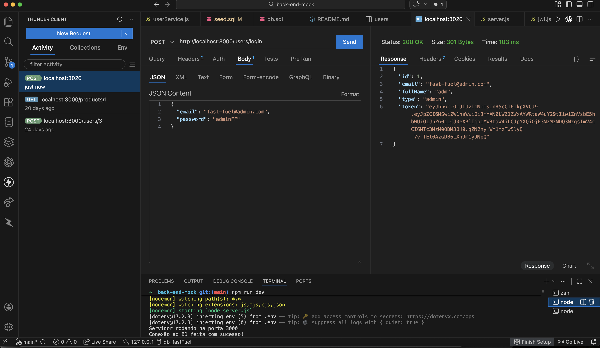
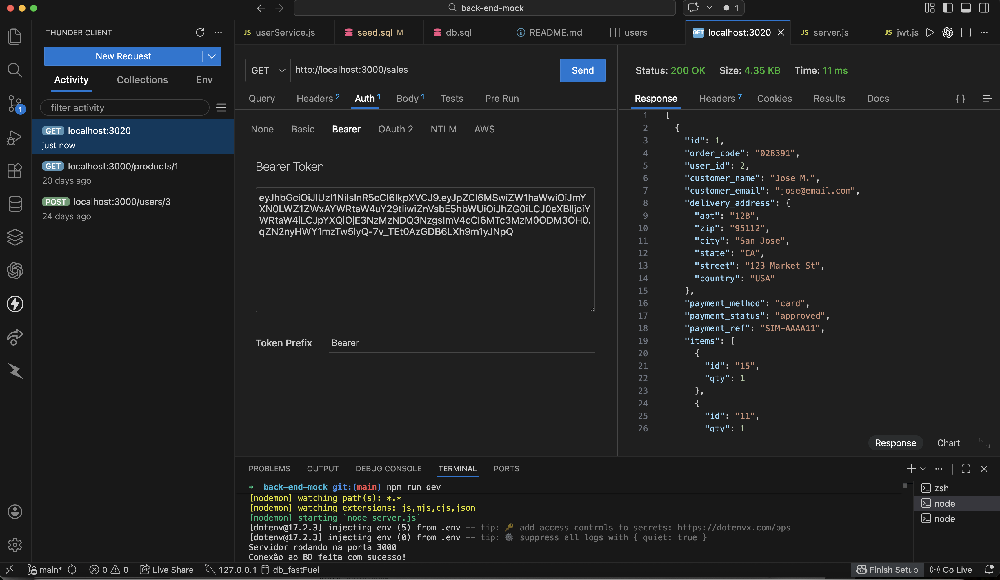
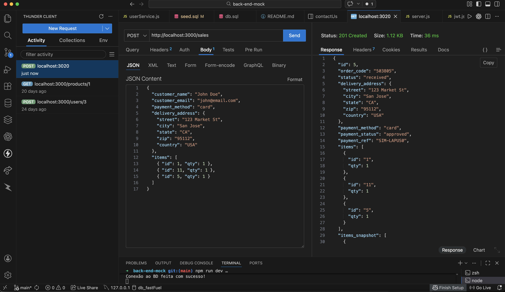
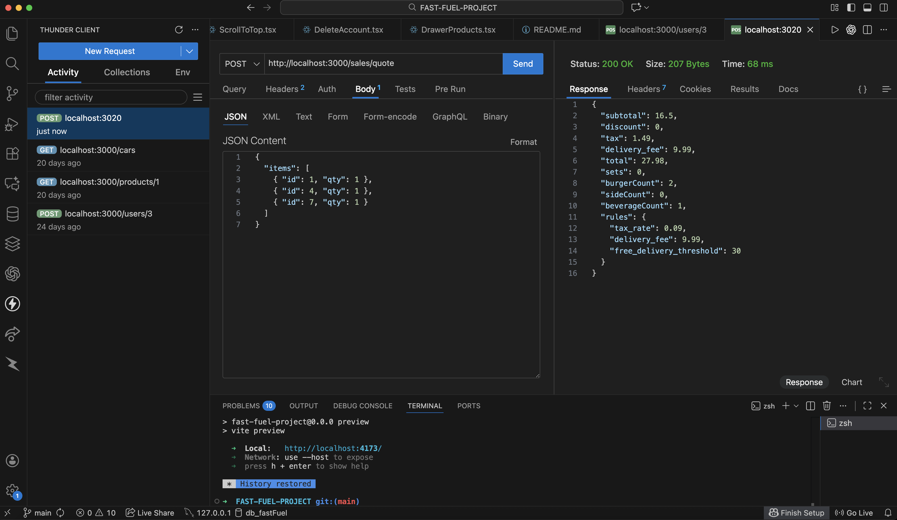
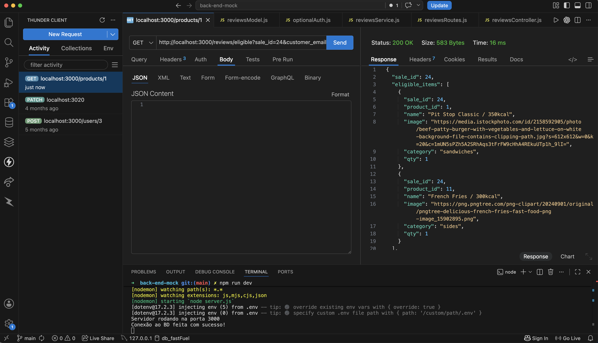
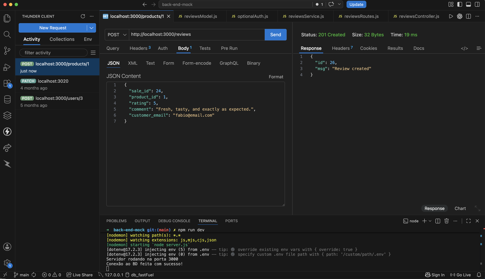
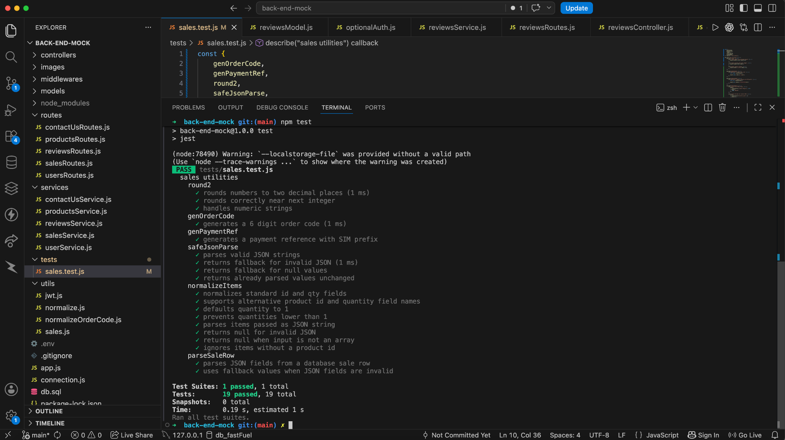

# Fast Fuel – Backend API

## Description

This repository contains the backend API for **Fast Fuel**, a fast-food ordering web application.

The API was built using **Node.js, Express, and MySQL**, and is responsible for handling product data, order creation, order tracking, customer contact messages, and administrative order management.

The backend communicates with the **Fast Fuel frontend application**, which provides the user interface where customers can browse the menu, place orders, and track their order status in real time. The API also includes a **product review system**, allowing users to leave verified feedback on items they have purchased.

The project follows a layered architecture based on **MVC and a Service Layer**, where routes, controllers, services, and models are separated to keep the code organized, scalable, and maintainable.

🔗 **Live Demo (Frontend):** https://fast-fuel-project.vercel.app/<br>
📦 **Frontend Repo:** https://github.com/fabioesilveira/FAST-FUEL-PROJECT

---

## Tech Stack

**Backend**

- Node.js  
- Express.js  

**Database**

- MySQL  

**Authentication & Security**

- JSON Web Tokens (JWT)  
- bcrypt (password hashing)

**Payments**

- Stripe API
- Stripe PaymentIntents
- Stripe Payment Element
- Stripe Sandbox / Test Mode

**Transactional Email**

- Resend API
- Automated order confirmation emails
- Email verification emails
- Password reset emails
- Custom domain email delivery

**Testing**

- Jest
- Supertest
- Unit and API integration testing

**CI/CD**

- GitHub Actions
- Railway CLI
- Automated test-before-deploy workflow

**Architecture**

- MVC (Model–View–Controller)
- Service Layer pattern
- REST API Design

**Deployment**

- Railway

---

## Backend Architecture

```mermaid
flowchart TD
A[Frontend React Vite] -->|HTTP Requests| B[Express API]
B --> C[Routes]
C --> D[Controllers]
D --> E[Service Layer - Business Logic]
E --> F[Models - Database Queries]
F --> G[(MySQL Database)]
E --> H[Stripe API - PaymentIntents]
E --> I[Resend API - Transactional Emails]
 ```
 ---

 ## Testing

The project includes automated backend tests using **Jest and Supertest** to validate API endpoints, backend utilities, and core business logic.

Tests run automatically through **GitHub Actions** on pushes and pull requests before deployment.

Run tests with:

```bash
npm test
```
---

## CI/CD

The backend uses **GitHub Actions** for continuous integration and deployment.

On pushes and pull requests to the `main` branch, the workflow:

- Installs dependencies using `npm ci`
- Runs the automated Jest and Supertest test suite
- Stops the pipeline if tests fail
- Deploys the backend to Railway only after successful validation

Production deployment is performed through the Railway CLI using a project-scoped deployment token stored securely as a GitHub Actions secret.

```text
Push / Pull Request
        ↓
GitHub Actions
        ↓
npm ci
        ↓
Jest + Supertest
        ↓
Tests Pass
        ↓
Railway Deployment
```
> **Pull requests run validation only, while pushes to `main` can trigger the production deployment.**

---

## Features

### Order System

Fast Fuel simulates a realistic order processing workflow. Customers can place orders by selecting products and the system automatically calculates the final price including tax, delivery fee, and combo discounts.

Orders move through a simple workflow that represents how a restaurant processes incoming orders.

- **received** – the order has been created by the customer  
- **in_progress** – the restaurant accepted the order and started preparing it  
- **sent** – the order has been dispatched for delivery  
- **completed** – the customer confirmed the order was received  

Each time the order status changes, the system records the corresponding timestamp in the database (for example when the order is accepted, sent, or confirmed). This allows the system to track when each step of the order process happened.

Administrators control the preparation and delivery stages while customers confirm when they receive their order.

---

### Checkout Quote Simulation

Before placing an order, the API can generate a **quote** for the selected cart items.

The system calculates:

- subtotal  
- tax  
- delivery fee  
- combo discounts  
- final total  

This simulates how checkout systems work in real food delivery applications.

---

### Stripe Payment Integration

Fast Fuel integrates with **Stripe PaymentIntents** to simulate a real payment processing workflow using Stripe's sandbox environment.

When a customer reaches checkout:

- The frontend sends the selected cart items to the backend
- The backend retrieves product prices from MySQL
- The server calculates subtotal, combo discounts, tax, delivery fee, and final total
- A Stripe PaymentIntent is created using the server-calculated amount
- The frontend displays Stripe's secure Payment Element
- The customer completes the payment using Stripe test payment methods
- The backend retrieves the PaymentIntent from Stripe and verifies that the payment succeeded
- The backend confirms that the Stripe payment amount matches the server-calculated order total
- Only after successful verification is the order stored in MySQL

The Stripe PaymentIntent ID is saved with the order as the payment reference.

This prevents the frontend from deciding the amount charged or marking a payment as approved without server-side verification.

The integration currently runs in **Stripe Sandbox / Test Mode**, so no real money is processed.

---

### Transactional Order Confirmation Emails

Fast Fuel integrates with **Resend** to automatically send transactional order confirmation emails after an order is successfully created.

The email is triggered by the backend after:

- Stripe payment verification succeeds
- The order is stored in MySQL
- A unique order number is generated

Confirmation emails include:

- Customer name
- Order number
- Delivery address
- Purchased products
- Product images
- Item quantities
- Item prices
- Subtotal
- Combo discount
- Tax
- Delivery fee
- Final total
- A direct link to track the order

Product information is generated using the stored order snapshot, ensuring that the email reflects the exact product data and pricing associated with the purchase.

Emails are sent through the verified Fast Fuel domain using:

`orders@fast-fuel-orders.com`

If email delivery fails, the order remains successfully created because email delivery is handled separately from the core order transaction.

---

#### Payment Flow

```text
Cart Items
    ↓
Fast Fuel Backend
    ↓
Server-side Price Calculation
    ↓
Stripe PaymentIntent
    ↓
Stripe Payment Element
    ↓
Payment Confirmation
    ↓
Backend Payment Verification
    ↓
MySQL Order Creation
```
---

### Guest Checkout

Orders can be created **without requiring authentication**, allowing users to place orders as guests. This mimics the quick checkout experience found in many modern delivery platforms.

---

### Order Snapshot System

When an order is created, the system saves a **snapshot of the product data** included in that order.

The snapshot stores information such as:

- product name  
- price  
- category  
- image  
- quantity  

This prevents future product updates from affecting past orders. For example, if a product price changes later, old orders will still show the original price.

---

### Admin Order Management

Administrators can manage incoming orders through protected routes.

Admins can:

- view all orders  
- inspect individual orders  
- update order status  

These routes are protected using middleware to ensure only authorized users can access them.

---

### Contact Message System

The API also includes a **Contact Us** feature that allows users to send messages directly to the restaurant.

These messages are stored in the database and can be accessed by administrators through the admin dashboard, making it easier to manage customer questions, feedback, and support requests.

---

### Product Reviews System

The API includes a **Product Reviews system** that allows customers to leave feedback on individual items after completing an order.

Reviews are directly linked to a specific order and product, ensuring that only users who actually purchased an item can review it.

Key features:

- **Verified purchase validation** – users can only review products included in their order  
- **One review per product per order** – prevents duplicate reviews  
- **Guest and authenticated support** – both logged users and guest users can leave reviews  
- **Rating system (1 to 5 stars)** – required field for each review  
- **Optional comment** – users can add feedback (up to 500 characters)  
- **Display name formatting** – user names are abbreviated (e.g., *John D.*) for privacy  

The system also calculates:

- **Average rating per product**  
- **Total number of reviews**

This system mirrors real-world review workflows used in food delivery and e-commerce platforms, where feedback is tied to verified purchases.

---

### Authentication and Security

The API includes user authentication using **JSON Web Tokens (JWT)**.

User passwords are securely stored using **bcrypt hashing**, preventing raw passwords from being stored in the database.

New accounts require **email verification** before authentication. Verification links are generated using cryptographically random tokens, while only hashed versions of those tokens are stored in the database.

The authentication system also includes a secure **forgot-password and password-reset workflow** using hashed, expiring reset tokens delivered through Resend.

Once authenticated, users receive a JWT token that allows them to access protected routes. Certain routes are restricted to administrators using role-based middleware.

Security features include:

- JWT authentication
- bcrypt password hashing
- Email verification
- Hashed and expiring verification tokens
- Forgot-password flow
- Hashed and expiring password reset tokens
- Password reuse validation
- Protected routes
- Role-based authorization
- User self-access restrictions

This ensures that sensitive account and administrative operations are only accessible to authorized users.

---

### Email Verification and Password Recovery

Fast Fuel includes an email verification and password recovery flow using secure, expiring tokens.

When a new user registers:

- A random verification token is generated on the backend
- Only a SHA-256 hash of the token is stored in MySQL
- The verification link is sent through Resend
- The token expires after a limited period
- The user must verify their email before signing in

The API also supports a complete forgot-password flow:

- Users can request a password reset link by email
- A cryptographically random reset token is generated
- Only the hashed token is stored in the database
- Reset tokens expire automatically
- The backend validates the token before allowing a password change
- Passwords are re-hashed with bcrypt before being stored
- Reset tokens are cleared after a successful password update

For security, password reset requests return a generic response regardless of whether the email exists, helping prevent account enumeration.

Successfully completing a password reset also confirms ownership of the email address and marks the account as verified when necessary.

---

### Clean Architecture (MVC + Service Layer)

Instead of placing business logic directly inside routes, the project separates responsibilities across multiple layers.

- **Routes** define API endpoints  
- **Controllers** handle request and response logic  
- **Services** contain the core business logic  
- **Models** handle database queries  
- **Utils** provide reusable helper functions  

This structure makes the code easier to maintain and closer to real production backend architectures.

---

## API Endpoints

Below are some of the main endpoints provided by the Fast Fuel backend API.

### Products

GET /products  
Retrieve all available products.

GET /products/category/:category  
Retrieve products filtered by category.

GET /products/category/:category/insights  
Retrieve category analytics, including product ratings, review counts, sales distribution, and random customer reviews.

GET /products/:id  
Retrieve details for a specific product.

POST /products  
Create a new product (admin only).

PUT /products/:id  
Update a product price (admin only).

DELETE /products/:id  
Remove a product (admin only).

Category insights include:

- Average rating per product
- Total number of reviews
- Total units sold
- Sales percentage distribution within the category
- Random customer reviews

### Payments

POST /payments/create-intent

Create a Stripe PaymentIntent for the current cart.

The frontend sends product IDs and quantities. The backend calculates the order total using product prices stored in MySQL before creating the PaymentIntent.

Example request:

```json
{
  "items": [
    {
      "id": 1,
      "qty": 1
    },
    {
      "id": 11,
      "qty": 1
    },
    {
      "id": 5,
      "qty": 1
    }
  ]
}
```
Example response:

```json
{
  "clientSecret": "pi_..._secret_...",
  "paymentIntentId": "pi_...",
  "amount": 19.26
}
```
---

### Orders

GET /sales  
Retrieve all orders (admin only).

GET /sales/:id  
Retrieve details for a specific order (admin only).

GET /sales/my-orders  
Retrieve orders belonging to the authenticated user.

POST /sales  
Create a new order. Supports both guest checkout and authenticated users.

POST /sales/quote  
Generate a checkout quote before placing an order. Calculates subtotal, combo discounts, tax, delivery fee, and final total.

POST /sales/track  
Track an order using the order code and customer email.

PATCH /sales/:id/status  
Update the order workflow (admin only).

Supported status transitions:

- received → in_progress
- in_progress → sent

PATCH /sales/:id/confirm-received  
Allow customers to confirm that an order was delivered, moving the order status to completed.

Order workflow:

- received
- in_progress
- sent
- completed

The API records timestamps for each stage of the order lifecycle, allowing order progress to be tracked over time.

---

### Reviews

GET /reviews  
Retrieve all product reviews. Supports sorting by newest or oldest using the `sort` query parameter.

Example:

```text
GET /reviews?sort=newest
GET /reviews?sort=oldest
```

GET /reviews/product/:productId  
Retrieve all reviews for a specific product, including average rating and total count.

GET /reviews/category/:category  
Retrieve all reviews for a given product category (e.g., sandwiches, beverages).

GET /reviews/eligible?sale_id=&customer_email=  
Retrieve products eligible for review from a completed order. Supports both authenticated users and guest users.

POST /reviews  
Create a new review for a product (requires a completed order).

Review system features:

- Verified purchase validation
- One review per product per order
- Support for authenticated and guest users
- Rating system (1–5 stars)
- Optional comments (up to 500 characters)
- Automatic display name abbreviation for privacy

---

### Users & Authentication

GET /users/admin  
Retrieve all users, including administrators (admin only).

GET /users  
Retrieve all normal users (admin only).

POST /users/register  
Create a new user account and send an email verification link.

POST /users/login  
Authenticate a verified user and return a JWT token.

GET /users/verify-email?token=  
Verify a user's email using the token sent by email.

POST /users/resend-verification  
Send a new verification email to an unverified account.

POST /users/forgot-password  
Request a password reset email.

POST /users/reset-password  
Reset a user's password using a valid password reset token.

GET /users/:id  
Retrieve details for a specific user. Users can access their own information, while administrators can access any user.

DELETE /users/removeUser  
Delete the currently authenticated user's account.

PUT /users/:id/password  
Update a user's password (admin only).

Authentication and security features:

- JSON Web Token (JWT) authentication
- Password hashing using bcrypt
- Email verification
- Verification tokens stored as SHA-256 hashes
- Expiring email verification tokens
- Forgot-password and password-reset workflow
- Password reset tokens stored as SHA-256 hashes
- Expiring password reset tokens
- Protected routes using middleware
- Role-based authorization for administrators
- Self-access restrictions for user information

---

### Contact Messages

GET /contact-us  
Retrieve all contact messages (admin only).

GET /contact-us/:id  
Retrieve a specific contact message (admin only).

POST /contact-us  
Create a new contact message.

PATCH /contact-us/:id/reply  
Mark a contact message as replied (admin only).

The Contact Messages system allows customers to send questions, feedback, and support requests directly to the restaurant.

Messages are stored in the database and can be managed by administrators through protected routes.

---

## Deployment

The Fast Fuel backend API is deployed on **Railway**.

Deployment is automated through **GitHub Actions**. On pushes to the `main` branch, the CI pipeline installs dependencies and runs the Jest and Supertest test suite. The backend is deployed to the Railway production service only after the validation job succeeds.

Railway manages the Node.js application, MySQL database connection, JWT secret, Stripe secret key, Resend API key, frontend URL, and production tracking URL through environment variables.

The deployed frontend communicates with the Railway API, payment processing is handled through Stripe's sandbox environment, and transactional emails are delivered through Resend using the verified `fast-fuel-orders.com` domain.

This creates a production-style workflow that includes automated testing, controlled deployment, payment verification, database persistence, transactional email delivery, and order tracking.

---

## Screenshots - MySQL Database Schema (Railway)


---

## How to Run This Project

### 1. Clone the repository

```bash
# 1) Clone the repo
git clone https://github.com/fabioesilveira/Back-end-FAST-FUEL

# 2) Navigate to project folder
cd Back-end-FAST-FUEL

# 3) Install dependencies
npm install 
```

Create a .env file in the root of the project and add your database credentials.

#### Example:

- DB_HOST=localhost
- DB_PORT=3306
- DB_USER=root
- DB_PASSWORD=your_password
- DB_NAME=fast_fuel
- JWT_SECRET=your_secret_key
- STRIPE_SECRET_KEY=sk_test_your_stripe_test_key
- RESEND_API_KEY=re_your_resend_api_key
- FRONTEND_URL=http://localhost:5173
- ORDER_TRACKING_URL=http://localhost:5173/orders

> Stripe and Resend secret keys must only be stored on the backend and must never be exposed in frontend code.

The frontend uses a separate Stripe publishable key through:

`VITE_STRIPE_PUBLISHABLE_KEY`

```bash
# 4) Start the development server

npm run dev
```

The API will start running locally.

#### Example:

```bash
http://localhost:3000
```

You can test the API using tools such as Postman, Insomnia, or Thunder Client.

---

## API Testing Examples

### Authentication – Admin Login (JWT)



---

### Protected Admin Route – Retrieve Orders



---

### Create Order – Guest Checkout



---

### Order Quote Calculation



---

### Verified Review Eligibility — Purchase Validation



---

### Verified Review Creation — REST API



---

### Backend Automated Tests – Jest + Supertest (19 Tests Passing)


